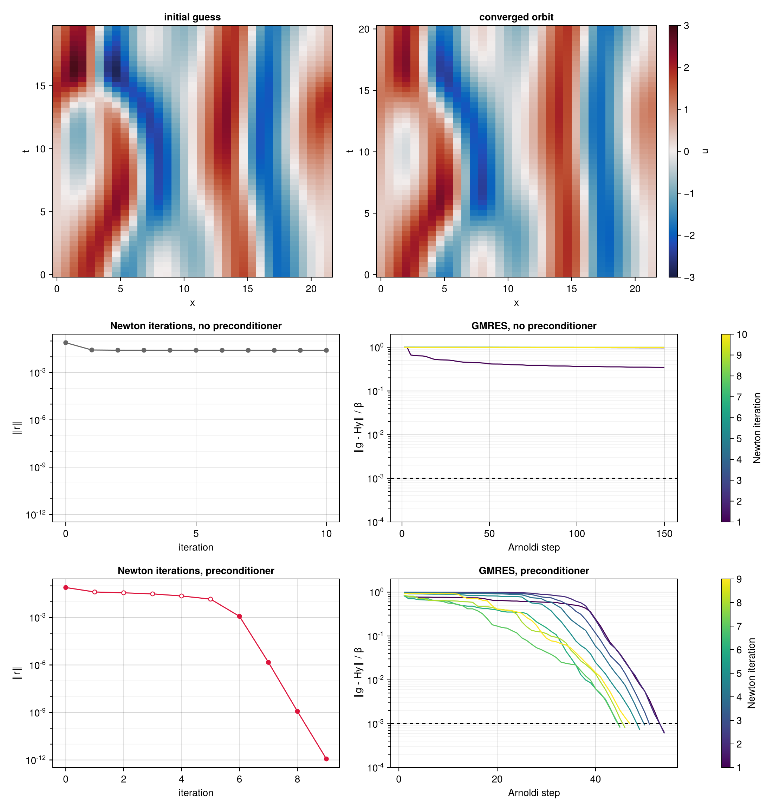

# ReSolverV2.jl

Space-time search for periodic and relative periodic orbits of dynamical systems.

Developed by Davide Lasagna, University of Southampton.

**Documentation: https://davide-lasagna-s-lab.github.io/ReSolverV2.jl/**

For a system $\partial_t u = N(u)$, possibly equivariant under translations along some spatial
directions, ReSolverV2 treats a whole periodic or relative periodic orbit as a single unknown: the
field over one period, written in terms of the rescaled time $s = \omega t \in [0, 2\pi)$, together
with the frequency $\omega = 2\pi/T$ and the drift speeds $c_i$ along the directions of symmetry. An
orbit is a zero of the space-time residual

$$
r(u, \omega, c) = \omega\,\partial_s u - \sum_i c_i\,\partial_i u - N(u),
$$

so no time integration is needed, and long or strongly unstable orbits are within reach. Two methods
are implemented in this package to drive the residual to zero:

- `LBFGS` minimises $\tfrac12\lVert r\rVert^2$ with a gradient computed from the adjoint operator,
  and is robust far from a solution;
- `NewtonHookstep` solves $r = 0$ with a Newton–Krylov iteration and a hookstep trust region, and
  converges fast close to one.

The search knows nothing about the system beyond a handful of functions supplied by the user: the
nonlinear operator, its linearisation and adjoint, and the derivatives in rescaled time and along the
drift directions. An optional preconditioner changes the metric in which both methods work, an
optional projection restricts the search to a symmetric subspace, and a `Trace` records the history
of a search. The package depends only on the Julia standard library.

## Installation

```julia
using Pkg
Pkg.add(url="https://github.com/Davide-Lasagna-s-Lab/ReSolverV2.jl")
```

## Example

The Kuramoto–Sivashinsky equation, $\partial_t u = -u\,\partial_x u - \partial_x^2 u - \partial_x^4 u$,
on a periodic domain of length $L = 22$ (Cvitanović, Davidchack & Siminos, SIAM J. Appl. Dyn. Syst.
2010). An orbit is searched for from a near-recurrence of a chaotic trajectory, with the model of
`examples/kuramoto_sivashinsky/ks.jl`, and the Newton–Krylov hookstep converges it with a
preconditioner built from the linear part of the equation; the search finds the shortest
pre-periodic orbit of the system, traversed twice:

```julia
using ReSolverV2
include("examples/kuramoto_sivashinsky/ks.jl")

g = KSGrid(22, 33, 49)                                # 33 points in x, 49 in rescaled time
x = initial_orbit(U, g, Δt, i, m, ℓ)                  # from a near-recurrence of a trajectory U

F = System(KSNonlinear(g), KSLinearised(g), KSLinearised(g; adjoint=true), dds!, x;
           linearise!, ddi=(ddx!,), B=KSPreconditioner(x; kind=:jacobian))

solve!(x, F, NewtonHookstep(maxiter=50, krylov_dim=150, Δ=0.1, Δmax=10))
```



Top: the initial guess and the converged orbit. Middle and bottom: the search without and with the
preconditioner; left, the residual against the Newton iterations, hooksteps open and full Newton
steps filled; right, the convergence of GMRES in each Newton iteration.

The `examples/` folder has the Kuramoto–Sivashinsky equation and the Lorenz system, each with a
model file, an example, a convergence study and an analysis of the preconditioners:

```
julia --project=examples examples/kuramoto_sivashinsky/example.jl
julia --project=examples examples/lorenz/example.jl
```

## A note on how this package was written

This package was written with AI assistance (Claude, by Anthropic). Developing it would have taken
me about two weeks, with a great deal of reasoning, manual derivations and reading. Claude did it
in a day. — Davide Lasagna

## License

MIT, see [LICENSE](LICENSE).
